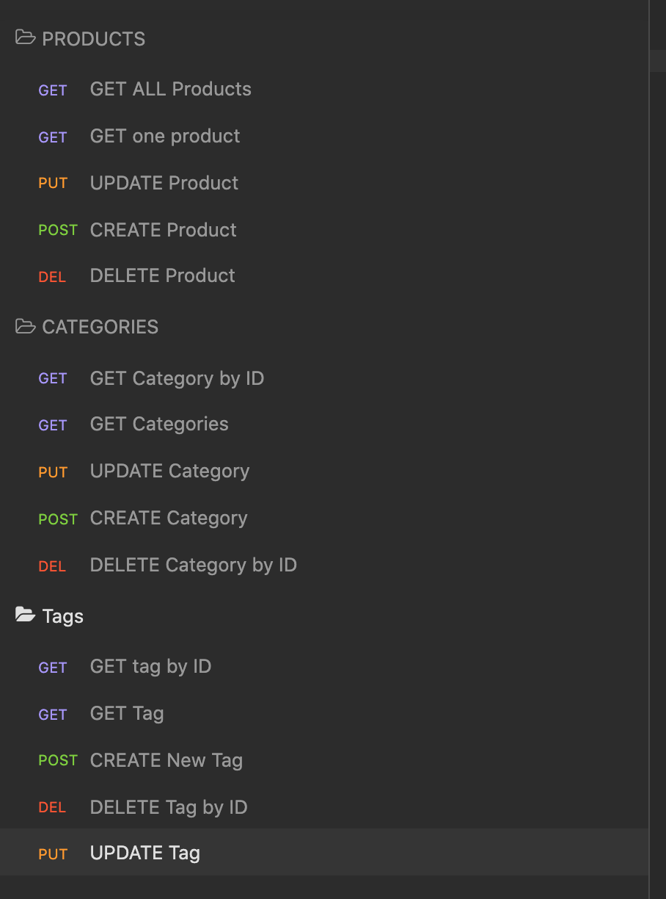

# ECommerce-Backend




### Desription

An E-Commerce Back end application that will allow the user to track all products and categories. 

  

  
### Video Walkthrough 
    
 https://drive.google.com/file/d/1w7bUh4S_krmNmcOpFJWlUymoU2uzyTDk/view


### Installation
```
Npm i - to install all dependencies
```

### Technologies Used:
 - JavaSCript
 - mySql
 - Sequelize
 - Express
 - Node.js